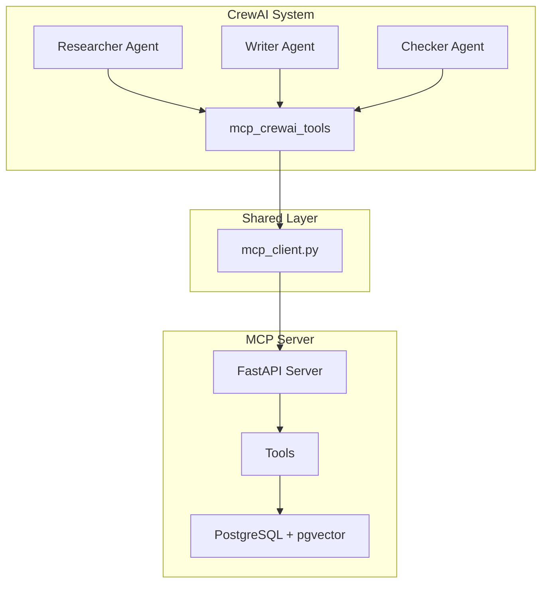

# Arsitektur Project MCP

Dokumentasi arsitektur untuk MCP (Model Context Protocol) project yang mencakup MCP server universal dan integrasi CrewAI.

## Overview

Project ini terdiri dari 2 komponen utama:

1. **MCP Server** (`mcp-docker/`) - Universal MCP server yang menyediakan tools untuk berbagai agents
2. **CrewAI Integration** (`crew/`) - Implementasi spesifik untuk CrewAI multi-agent system

## Struktur Direktori

```
/home/aseps/MCP/
├── shared/                      # Shared utilities
│   ├── mcp_client.py           # Universal MCP client
│   └── README.md               # Documentation
│
├── crew/                        # CrewAI integration
│   ├── agents/                 # Agent definitions
│   │   ├── researcher.py       # Research & analysis agent
│   │   ├── writer.py           # Documentation writer agent
│   │   └── checker.py          # QA & validation agent
│   ├── tasks/                  # Task definitions
│   │   ├── research_task.py
│   │   ├── write_task.py
│   │   └── check_task.py
│   ├── tools/                  # CrewAI-specific tools
│   │   ├── mcp_crewai_tools.py # BaseTool wrappers
│   │   └── ml_analyzer.py      # ML code analysis
│   ├── main.py                 # Main execution
│   └── run-crew.sh             # Startup script
│
├── mcp-docker/                  # MCP server
│   ├── mcp_server.py           # FastAPI server
│   ├── tools/                  # Server tools
│   │   ├── list_dir.py
│   │   ├── read_file.py
│   │   ├── file_writer.py
│   │   ├── memory.py           # PostgreSQL + pgvector
│   │   └── run_shell.py
│   └── docker-run.sh           # Docker startup
│
└── scripts/                     # Utility scripts
    ├── cleanup_old_reports.py  # Cleanup automation
    ├── quality_monitor.py
    └── setup_quality_standards.py
```

## Component Interactions



## Data Flow

### 1. CrewAI Workflow
```
User Request → main.py → Crew Orchestration
    ↓
Researcher Agent (analyze project)
    ↓ (uses mcp_crewai_tools)
shared/mcp_client.py → MCP Server → Tools
    ↓
Writer Agent (create docs)
    ↓
Checker Agent (validate)
    ↓
Output: Documentation + QA Report
```

### 2. MCP Server Standalone
```
External Agent → HTTP Request → FastAPI Server
    ↓
JSON-RPC Protocol
    ↓
Tool Dispatcher → Specific Tool (list_dir, read_file, etc.)
    ↓
Response → JSON-RPC Format → Agent
```

## Key Design Decisions

### Shared Utilities (`shared/`)
- **Purpose**: Menghindari duplikasi kode antara crew dan mcp-docker
- **Content**: `mcp_client.py` - universal client untuk komunikasi dengan MCP server
- **Benefits**: 
  - Single source of truth
  - Easier maintenance
  - Consistent behavior across components

### Separation of Concerns
- **MCP Server**: Fokus pada tool execution dan protocol handling
- **CrewAI Integration**: Fokus pada agent orchestration dan workflow
- **Shared Layer**: Reusable utilities

### Memory System
- PostgreSQL 16 dengan pgvector extension
- Hybrid search (semantic + keyword)
- Async connection pooling untuk performance

## Technology Stack

### Core
- **Python 3.12+**
- **FastAPI** - MCP server HTTP endpoint
- **CrewAI 1.7.2** - Multi-agent orchestration

### Database
- **PostgreSQL 16** - Long-term memory
- **pgvector** - Vector similarity search
- **psycopg v3** - Async database driver

### ML/AI
- **scikit-learn** - Code quality analysis
- **Ollama** - Embeddings generation (optional)
- **LLM Integration** - Via CrewAI

### Infrastructure
- **Docker** - Containerization
- **Bash scripts** - Automation

## Import Patterns

### From CrewAI Components
```python
# Import shared MCP client
import sys
import os
sys.path.insert(0, os.path.dirname(os.path.dirname(__file__)))
from shared.mcp_client import call_mcp_tool, mcp_list_dir

# Use in tools
result = mcp_list_dir("/workspace")
```

### From MCP Server Tools
```python
# Direct import (same package)
from tools.memory import memory_save, memory_search
```

## Maintenance Guidelines

### Adding New Tools
1. Create tool in `mcp-docker/tools/`
2. Register in `mcp_server.py`
3. If needed by CrewAI, add wrapper in `crew/tools/mcp_crewai_tools.py`

### Updating Shared Utilities
1. Make changes in `shared/`
2. Test with both crew and mcp-docker
3. Update documentation
4. Ensure backward compatibility

### Cleanup
```bash
# Run cleanup script for old reports
python scripts/cleanup_old_reports.py --dry-run
python scripts/cleanup_old_reports.py --execute --days 7
```

## Future Enhancements

- [ ] Unified configuration system
- [ ] Centralized logging
- [ ] Metrics and monitoring
- [ ] API versioning
- [ ] Plugin system for tools
- [ ] Multi-language support

## References

- [MCP Protocol Specification](https://modelcontextprotocol.io/)
- [CrewAI Documentation](https://docs.crewai.com/)
- [FastAPI Documentation](https://fastapi.tiangolo.com/)
