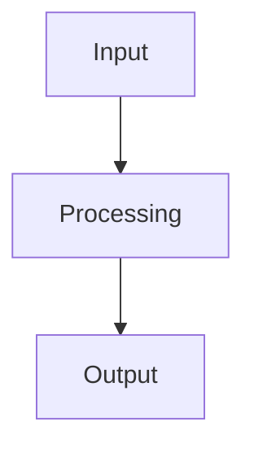

# {{ project_name | default("MCP Project") }} Documentation

**Version**: {{ version | default("1.0.0") }}  
**Generated**: {{ generated_date }} at {{ generated_time }}  
**Language**: {{ language | default("English") }}

## 📋 Table of Contents


- [{{ section.title }}](#{{ section.title | lower | replace(' ', '-') }})


## {{ sections[0].title if sections else "Overview" }}

{{ overview | default("This documentation provides comprehensive information about the project.") }}

### Key Features


- **{{ feature.name }}**: {{ feature.description }}


## {{ sections[1].title if sections | length > 1 else "Architecture" }}

{{ architecture | default("System architecture overview.") }}



## {{ sections[2].title if sections | length > 2 else "Installation" }}

{{ installation | default("Installation instructions.") }}

### Prerequisites


- {{ prereq }}


### Setup Steps


{{ loop.index }}. {{ step }}


## {{ sections[3].title if sections | length > 3 else "Usage" }}

{{ usage | default("Usage examples and patterns.") }}

### Basic Example

```{{ code_language | default("python") }}
{{ basic_example | default("# Your code here") | highlight_code(code_language | default("python")) }}
```

### Advanced Usage


#### {{ example.title }}

{{ example.description }}

```{{ example.language | default("python") }}
{{ example.code | highlight_code(example.language | default("python")) }}
```



## {{ sections[4].title if sections | length > 4 else "API Reference" }}

{{ api_reference | default("Complete API documentation.") }}

### Endpoints


#### {{ endpoint.method }} {{ endpoint.path }}

{{ endpoint.description }}

**Parameters:**

- `{{ param.name }}` ({{ param.type }}): {{ param.description }}


**Response:**
```json
{{ endpoint.response | default("{}") }}
```



## {{ sections[5].title if sections | length > 5 else "Troubleshooting" }}

{{ troubleshooting | default("Common issues and solutions.") }}

### FAQ


**Q: {{ faq.question }}**

A: {{ faq.answer }}



### Error Codes


- `{{ error.code }}`: {{ error.description }}


## Contributing

{{ contributing | default("Guidelines for contributing to this project.") }}

## Changelog


### {{ entry.version }} - {{ entry.date }}


- {{ change }}




---

*Documentation generated by CrewAI Template Engine v{{ version }}*
