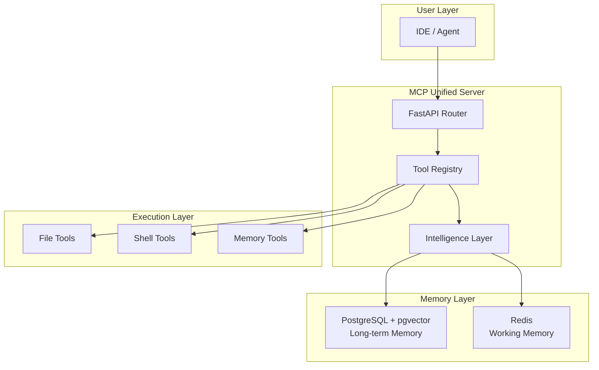

# 02-architecture — Arsitektur Sistem

Dokumentasi arsitektur untuk MCP Unified Server mencakup system design, data flow, dan komponen-komponen utama.

## 📋 Konten

| File | Deskripsi |
|------|-----------|
| [`system-overview.md`](./system-overview.md) | Overview arsitektur dan komponen utama |
| [`data-flow.md`](./data-flow.md) | Alur data dan workflow sistem |

## 🏗️ System Overview

## 🧩 Komponen Utama

### Core Server (`mcp-unified/`)
- **FastAPI Router**: Entry point untuk MCP protocol
- **Tool Registry**: Registrasi dan discovery tools
- **Intelligence Layer**: Planner, self-healing, dan optimasi

### Memory System
- **Long-term Memory**: PostgreSQL + pgvector untuk semantic search
- **Working Memory**: Redis untuk session state
- **Namespace Isolation**: Isolasi data antar project

### Execution Tools
- **File Tools**: Read/write file dengan path validation
- **Shell Tools**: Command execution dengan whitelist
- **Memory Tools**: CRUD operations untuk memory

## 🔄 Data Flow

Lihat detail lengkap di [`data-flow.md`](./data-flow.md):

1. **Autonomous Workflow**: User Request → Planner → Scheduler → Execution
2. **Memory Workflow**: Context Storage → Retrieval → Learning Loop
3. **Multi-Agent Workflow**: CrewAI collaboration dengan memory backend

## 🛡️ Security Architecture

- **Shell Whitelist**: Explicit allowed commands only
- **Path Validation**: Sandbox path restriction
- **Namespace Isolation**: Cross-project contamination prevention
- **Circuit Breaker**: Failure protection

## 📖 Related Documentation

- **Database Schema** → [`06-database/`](../06-database/)
- **Development Guide** → [`03-development/`](../03-development/)
- **Integrations** → [`05-integrations/`](../05-integrations/)
