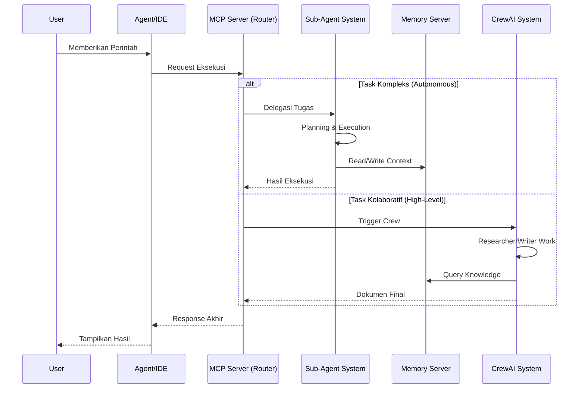

# System Workflow

Dokumen ini menjelaskan alur kerja rinci dari berbagai subsistem dalam proyek MCP Universal.

## 1. Alur Interaksi Global (High-Level Interaction)

Sistem beroperasi sebagai jembatan antara User/IDE dan berbagai kapabilitas otonom.

## 2. Alur Kerja Memori (LTM Workflow)

Sistem memori bertindak sebagai "otak" persisten yang menyimpan pengalaman dan pengetahuan proyek.

### A. Penyimpanan Konteks (Context Storage)
Setiap interaksi atau perubahan kode yang signifikan disimpan untuk referensi masa depan.
1.  **Input Capture**: Data teks (chat, kode, docs) diterima.
2.  **Chunking**: Data dipecah menjadi segmen-segmen logis.
3.  **Embedding**: Setiap chunk diubah menjadi vektor menggunakan model embedding.
4.  **Storage**: Vektor dan metadata (timestamp, source) disimpan ke PostgreSQL (`pgvector`).

### B. Retrieval & Recall
Saat agen bekerja, ia memanggil memori untuk memahami konteks.
1.  **Query**: Agen mengirimkan query terkait tugas saat ini.
2.  **Similarity Search**: Database mencari vektor yang memiliki jarak cosine terdekat.
3.  **Filtering**: Hasil difilter berdasarkan relevansi dan recency.
4.  **Context Injection**: Informasi yang relevan dikembalikan ke agen sebagai konteks prompt.

### C. Automated Learning Loop
Mekanisme untuk meningkatkan performa seiring waktu.
1.  **Task Completion**: Sub-agent menyelesaikan tugas.
2.  **Experience Extraction**: Sistem mengekstrak pola solusi (misal: "Cara fix bug X").
3.  **Experience Archival**: Solusi sukses disimpan sebagai "Experience Entry" khusus di memori.
4.  **Future Planning**: Saat tugas serupa muncul, planner mengambil Experience Entry ini untuk memandu strategi.

## 3. Alur Kerja Sub-Agent (Autonomous Execution)

Sub-agent system dirancang untuk menyelesaikan tugas teknis secara mandiri.

### Tahap 1: Inisialisasi & Perencanaan
-   **Input**: User Prompt.
-   **Planner Agent**:
    1.  Menganalisis permintaan.
    2.  Mengambil konteks dari Memori.
    3.  Membuat **Implementation Plan** (daftar langkah).
    4.  Mendefinisikan dependensi antar langkah.

### Tahap 2: Penjadwalan (Scheduling)
-   **Execution Scheduler**:
    1.  Memuat rencana ke dalam antrian (Task Queue).
    2.  Memantau `status` setiap langkah (Pending -> Running -> Completed).
    3.  Menugaskan langkah yang siap (dependensi terpenuhi) ke agen yang sesuai.

### Tahap 3: Eksekusi Spesialis
Setiap langkah ditangani oleh agen spesialis:
-   **File Agent**: Membaca/Menulis file, manipulasi sistem file.
-   **Code Agent**: Analisis AST, refactoring, code generation.
-   **Terminal Agent**: Menjalankan command, git ops, testing.
-   **Search Agent**: Mencari referensi dalam codebase atau memori.

### Tahap 4: Verifikasi & Pelaporan
-   Setelah semua langkah selesai, scheduler memicu **Verification**.
-   Jika sukses: Hasil dikompilasi menjadi laporan akhir.
-   Jika gagal: Error dikirim kembali ke Planner untuk re-planning (Self-Correction).

## 4. Alur Kerja CrewAI (Multi-Agent Collaboration)

Digunakan untuk tugas yang lebih bersifat kualitatif atau pembuatan konten tingkat tinggi.

1.  **Task Definition**: Tugas didefinisikan dalam `tasks.yaml`.
2.  **Agent Assignation**: Agen (Researcher, Writer, dst) diberikan peran sesuai `agents.yaml`.
3.  **Sequential/Hierarchical Process**:
    -   **Researcher**: Menggunakan tool `mcp_client` untuk mencari info di Memory atau file.
    -   **Writer**: Menyusun draft berdasarkan hasil riset.
    -   **Reviewer**: Memvalidasi kualitas output.
4.  **Final Output**: Dokumen Markdown atau laporan disimpan di `workspace/outputs`.