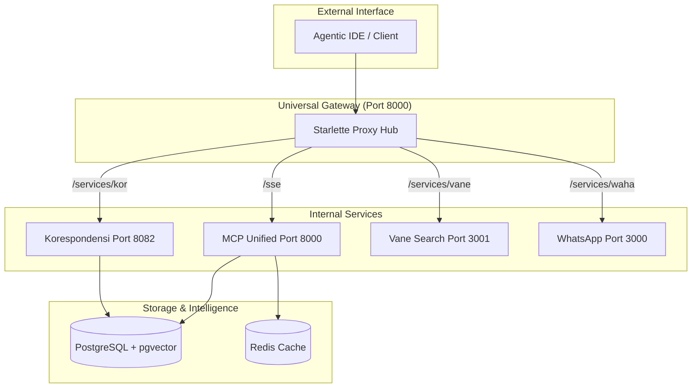

# Arsitektur Project MCP

Dokumentasi arsitektur untuk MCP (Model Context Protocol) project yang mencakup MCP server universal dan sistem sub-agent otonom.

## Overview

Project ini terdiri dari 3 komponen utama:

1. **MCP Memory Server** (`mcp-memory/`) - Universal MCP server yang menyediakan fitur long-term memory (PostgreSQL + pgvector).
2. **MCP Sub-Agent System** (`mcp-subagent-system/`) - Sistem untuk dekomposisi dan eksekusi tugas kompleks secara otonom.
3. **CrewAI Integration** (`crew/`) - Implementasi workflow multi-agent berbasis CrewAI.

## Struktur Direktori

```
/home/aseps/MCP/
├── shared/                         # Shared utilities
│   ├── mcp_client.py              # Universal MCP client
│   └── README.md                  # Documentation
│
├── crew/                           # CrewAI integration
│   ├── agents/                    # Agent definitions
│   ├── tasks/                     # Task definitions
│   ├── i18n/                      # Internationalization supports
│   ├── templates/                 # Document templates
│   ├── main.py                    # Main orchestration
│   └── run-crew.sh                # Startup script
│
├── mcp-memory/                     # Universal Memory Server
│   ├── mcp_server.py              # FastAPI server
│   ├── tools/                     # Server tools (memory, fs, shell)
│   │   ├── memory.py
│   │   ├── list_dir.py
│   │   └── run_shell.py
│   └── docker-run.sh              # Startup script
│
├── mcp-subagent-system/            # Autonomous Sub-Agent System
│   ├── mcp_server.py              # Entry point (sebelumnya server.py)
│   ├── engine/                    # Planning & Scheduling engines
│   │   ├── planning.py
│   │   └── scheduler.py
│   ├── agents/                    # Specialized sub-agents
│   └── mcp-run.sh                 # Startup script
│
├── logs/                           # Centralized logs (Auto-cleanup)
│   ├── mcp-subagent.log
│   └── mcp-memory.log
│
├── workspace/                      # Transient outputs & temp files
│   ├── outputs/                   # Final results/reports
│   └── temp/                      # Temporary files
│
└── scripts/                        # Utility & Quality scripts
    ├── workspace_manager.py       # Workspace cleanup & management
    ├── quality_monitor.py         # Code quality monitoring
    └── setup_quality_standards.py # Quality environment setup
```

## Component Interactions



## Data Flow

### 1. Autonomous Workflow (Sub-Agent)
```
User Request → mcp_server.py (execute_task)
    ↓
Planning Engine (Decomposition)
    ↓
Execution Scheduler (Routing)
    ↓
Specialized Agents → shared/mcp_client.py → Memory Server
```

### 2. Multi-Agent Workflow (CrewAI)
```
User Request → crew/main.py
    ↓
Agents (Researcher, Writer, Checker)
    ↓
shared/mcp_client.py → Memory Server → Tools
```

## Key Design Decisions

### Shared Utilities (`shared/`)
- **Purpose**: Menghindari duplikasi kode antar komponen.
- **Content**: `mcp_client.py` - universal client untuk komunikasi antar MCP server.

### Modular Memory
- `mcp-memory` dipisahkan agar bisa digunakan oleh berbagai sistem agent (CrewAI, Sub-Agent, atau external agent) sebagai single source of truth untuk konteks proyek.

### Separation of Concerns
- **Sub-Agent System**: Fokus pada penyelesaian tugas teknis yang memerlukan dekomposisi.
- **CrewAI**: Fokus pada kolaborasi tingkat tinggi dan pembuatan dokumen.
- **Memory Server**: Fokus pada penyimpanan dan pengambilan informasi berbasis semantik.

## Technology Stack

### Core
- **Python 3.12+**
- **FastAPI** - MCP server endpoints
- **CrewAI 1.7.2+** - Multi-agent orchestration

### Database
- **PostgreSQL 16** - Long-term memory
- **pgvector** - Vector similarity search

### Infrastructure
- **Bash scripts** - Startup & Automation scripts
- **Docker** - Containerization (optional)

## Maintenance Guidelines

### Updating Documentation
1. Selalu pastikan `docs/ARCHITECTURE.md` sinkron dengan struktur folder aktual.
2. Perbarui diagram Mermaid jika ada perubahan interaksi antar komponen.

### Cleanup
```bash
# Gunakan cleanup script untuk laporanan lama
python scripts/cleanup_old_reports.py --execute --days 7
```

## References

- [MCP Protocol Specification](https://modelcontextprotocol.io/)
- [CrewAI Documentation](https://docs.crewai.com/)
- [FastAPI Documentation](https://fastapi.tiangolo.com/)
