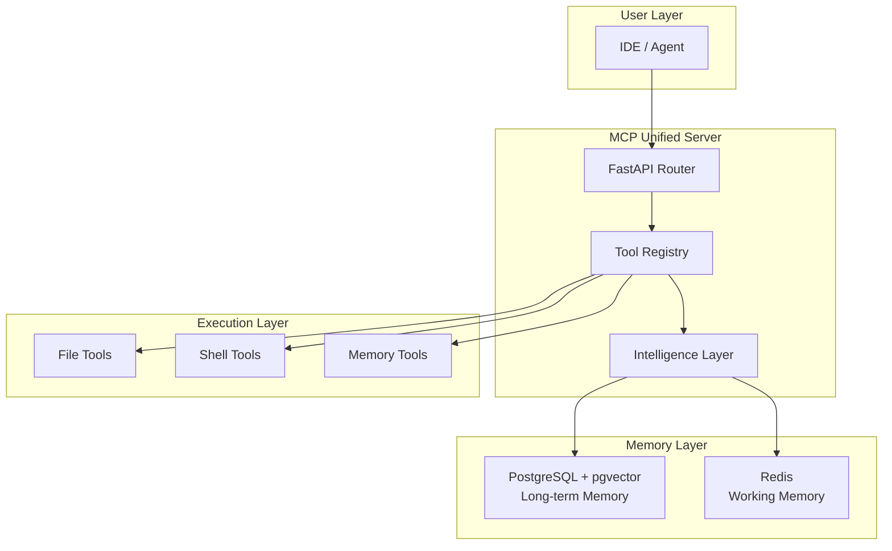

# 📚 Dokumentasi MCP Unified Server

> **Personal MCP Hub** — Infrastruktur agent terpusat yang bisa digunakan oleh agent manapun dari folder manapun tanpa setup ulang.

---

## 🗂️ Navigasi Dokumentasi

Dokumentasi ini diorganisir dengan numerik prefix untuk urutan logis pembacaan:

| Folder | Kategori | Deskripsi |
|--------|----------|-----------|
| [`00-meta/`](./00-meta/) | Meta | Cara menggunakan dokumentasi ini |
| [`01-getting-started/`](./01-getting-started/) | Getting Started | Install, setup, dan quick start |
| [`02-architecture/`](./02-architecture/) | Arsitektur | System design dan data flow |
| [`03-development/`](./03-development/) | Development | Development guide dan standards |
| [`04-operations/`](./04-operations/) | Operasional | Deployment, DR, dan maintenance |
| [`05-integrations/`](./05-integrations/) | Integrasi | Third-party integrations |
| [`06-database/`](./06-database/) | Database | Schema dan migrasi database |
| [`99-archive/`](./99-archive/) | Arsip | Dokumentasi lama (referensi) |

---

## 🚀 Quick Start

```bash
# 1. Setup environment
cp .env.example .env
# Edit .env dengan konfigurasi Anda

# 2. Start services
docker-compose up -d postgres redis

# 3. Run MCP Server
cd mcp-unified && ./run.sh

# 4. Verify
curl http://localhost:8000/health
```

📖 **Detail lengkap**: Lihat [`01-getting-started/`](./01-getting-started/)

---

## 🏗️ System Overview



---

## 📋 Status Sistem

| Komponen | Status | Dokumentasi |
|----------|--------|-------------|
| Core Server | ✅ Running | [`02-architecture/`](./02-architecture/) |
| Long-term Memory | ✅ PostgreSQL + pgvector | [`06-database/`](./06-database/) |
| Working Memory | ✅ Redis | [`02-architecture/`](./02-architecture/) |
| Security Hardening | ✅ Phase 1 Complete | [`04-operations/security.md`](./04-operations/security.md) |
| Task System | ✅ Active | [`03-development/task-system.md`](./03-development/task-system.md) |

---

## 🔍 Konteks Session

**Siapa**: Developer membangun Personal MCP Hub  
**Status**: Sudah melalui full review cycle (TASK-001 s/d TASK-011)  
**Fase Sekarang**: Merancang mekanisme **Discovery & Portability**  

📄 **Session Context**: [`01-getting-started/session-brief.md`](./01-getting-started/session-brief.md)

---

## 🛠️ Tech Stack

| Layer | Technology |
|-------|------------|
| Core | Python 3.12+, FastAPI |
| Memory | PostgreSQL 16 + pgvector, Redis |
| Protocol | MCP (Model Context Protocol) |
| Deployment | Docker, systemd |

---

## 📖 Dokumentasi Terkait

- **MCP Protocol**: https://modelcontextprotocol.io/
- **CrewAI**: https://docs.crewai.com/
- **FastAPI**: https://fastapi.tiangolo.com/

---

## 🤝 Kontribusi

Dokumentasi ini menggunakan struktur numerik prefix:
- `00-`: Meta dan guidelines
- `01-99`: Urutan logis pembacaan
- Dua digit untuk memungkinkan penambahan folder di tengah tanpa rename

---

*Last Updated: 2026-02-20*
