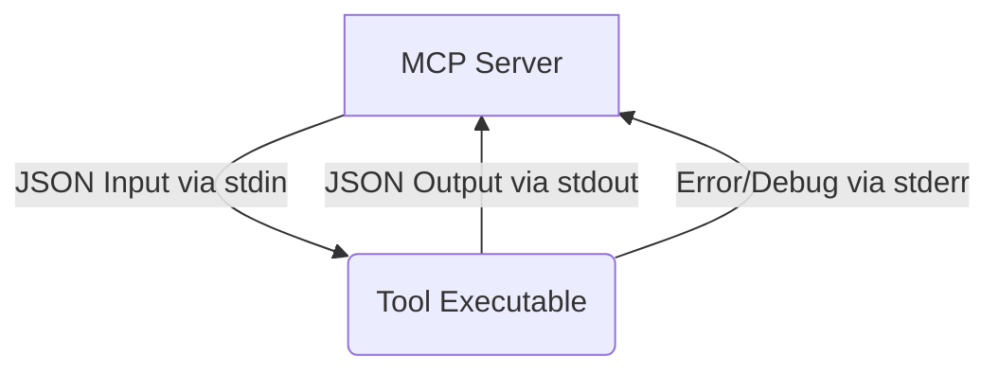

# MCP Project Documentation v1.0

## Table of Contents
1.  [Executive Summary](#1-executive-summary)
2.  [Architecture Overview](#2-architecture-overview)
3.  [Core Components](#3-core-components)
    *   [Main Server (`mcp_server.py`)](#31-main-server-mcp_serverpy)
    *   [Database (`mcp_data.db`)](#32-database-mcp_datadb)
    *   [Tools Orchestration](#33-tools-orchestration)
    *   [Memory Management](#34-memory-management)
    *   [Analysis Logging](#35-analysis-logging)
4.  [Tools Reference](#4-tools-reference)
    *   [memory_fixed.py](#41-memory_fixedpy)
    *   [list_dir.py](#42-list_dirpy)
    *   [read_file.py](#43-read_filepy)
    *   [file_writer.py](#44-file_writerpy)
    *   [run_shell.py](#45-run_shellpy)
5.  [Memory System](#5-memory-system)
    *   [Database Schema](#51-database-schema)
    *   [Current Memory State](#52-current-memory-state)
6.  [Installation & Setup](#6-installation--setup)
    *   [Prerequisites](#61-prerequisites)
    *   [Local Setup](#62-local-setup)
    *   [Docker Setup](#63-docker-setup)
7.  [API Reference](#7-api-reference)
    *   [Server-Tool Communication Protocol](#71-server-tool-communication-protocol)
    *   [Tool Input/Output Structure](#72-tool-inputoutput-structure)
8.  [Usage Examples](#8-usage-examples)
    *   [Storing and Retrieving Memory](#81-storing-and-retrieving-memory)
    *   [Listing Directory Contents](#82-listing-directory-contents)
    *   [Reading a File](#83-reading-a-file)
    *   [Writing to a File](#84-writing-to-a-file)
    *   [Executing Shell Commands](#85-executing-shell-commands)
9.  [Best Practices](#9-best-practices)
    *   [Modular Design](#91-modular-design)
    *   [Memory Management](#92-memory-management)
    *   [Security Considerations](#93-security-considerations)
    *   [Documentation](#94-documentation)
10. [Troubleshooting](#10-troubleshooting)
    *   [Tool Execution Errors](#101-tool-execution-errors)
    *   [Memory Retrieval Issues](#102-memory-retrieval-issues)
    *   [Security Warnings for `run_shell.py`](#103-security-warnings-for-run_shellpy)
11. [Contributing](#11-contributing)
    *   [Contribution Guidelines](#111-contribution-guidelines)
    *   [Code Style](#112-code-style)
    *   [Testing](#113-testing)

## 1. Executive Summary

The Multi-Component Project (MCP) Server is a robust, CLI/internal platform engineered for advanced orchestration of tool execution, persistent memory interactions, and comprehensive project workflow management. Designed with modularity and extensibility at its core, MCP facilitates the integration of isolated Python tools, including specialized Machine Learning components. Its hybrid memory architecture, underpinned by an SQLite database, ensures persistent context storage and meticulous logging of all activities.

MCP's primary purpose is to provide a flexible and scalable foundation for orchestrating tasks, managing contextual memory, and logging actions critical for AI development and analysis. The core server remains agnostic to specific ML libraries, allowing for dynamic integration of ML functionalities as separate tools. Key architectural findings highlight its reliance on separate Python tools orchestrated by a central server, the critical role of its hybrid memory system for context retention, and the powerful yet security-sensitive `run_shell.py` tool. Currently, the system's self-awareness regarding its own structure through persistent memory can be enhanced, presenting an opportunity for further development. This documentation provides a comprehensive guide to MCP's architecture, components, usage, and best practices, aiming to support developers and researchers in leveraging its capabilities effectively.

## 2. Architecture Overview

The Multi-Component Project (MCP) Server is architected as a modular and extensible platform, designed to efficiently manage diverse tasks, persistent memory, and workflow orchestration. At its heart, a central Python server (`mcp_server.py`) acts as the orchestrator, coordinating the execution of isolated Python tools, managing interactions with a hybrid memory system, and logging all activities for auditability and analysis.

**High-Level System Design:**

*   **Central Orchestrator:** The `mcp_server.py` is the control hub. It's responsible for loading, validating, and executing external Python tools. It handles the communication pipeline, directing inputs to tools and processing their outputs.
*   **Modular Tools:** All specific functionalities (e.g., file operations, memory management, shell execution) are encapsulated in independent Python scripts located in the `/workspace/tools` directory. These tools communicate with the central server via standardized JSON messages over `stdin`/`stdout`. This design promotes high cohesion within tools and low coupling between tools and the server, making the system highly extensible.
*   **Hybrid Memory System:** A crucial component is the persistent memory system, powered by an SQLite3 database (`mcp_data.db`). This database serves two primary purposes:
    *   **Contextual Memory:** Stores key-value pairs, acting as a persistent knowledge base for the agents, allowing the system to retain context across different operations.
    *   **Analysis Logs:** Records detailed logs of every action performed by the server and its tools, providing a comprehensive audit trail for debugging, analysis, and system understanding.
*   **ML Agnostic Core:** The core MCP server is designed to be independent of specific Machine Learning libraries. ML functionalities are intended to be integrated as separate, specialized tools, enabling flexibility in technology choices (e.g., TensorFlow, PyTorch, scikit-learn can be added as needed without modifying the core).
*   **Containerization:** The entire environment is containerized using Docker, ensuring consistent deployment and execution across different environments. Scripts like `Dockerfile`, `docker-build.sh`, and `docker-run.sh` facilitate this process.

**Communication Flow:**
The server and tools interact using a simple, robust protocol: JSON objects passed via `stdin` for input and `stdout` for output. This standardized interface simplifies tool development and integration.

**Key Design Principles:**

*   **Modularity:** Functionalities are broken down into small, independent tools.
*   **Extensibility:** New tools can be added easily without altering the core server logic.
*   **Persistence:** A dedicated memory system ensures that context and logs are retained.
*   **Auditability:** Comprehensive logging provides insights into system operations.

## 3. Core Components

The MCP ecosystem is built upon several critical components that work in synergy to provide its core functionality.

### 3.1. Main Server (`mcp_server.py`)

*   **Description:** This Python script (`mcp_server.py`) is the central orchestrator of the entire MCP project. It manages the lifecycle of tool execution, mediates interactions with the memory system, and diligently logs all operational activities. It is the primary control point for the platform.
*   **Functionality:**
    *   **Tool Loading & Execution:** Discovers and loads Python scripts from the `/workspace/tools` directory, then executes them as subprocesses.
    *   **Input/Output Handling:** Manages the communication pipeline by sending JSON-formatted input to tools via `stdin` and capturing their JSON-formatted output from `stdout` or errors from `stderr`.
    *   **Memory Integration:** Provides internal functions to `store_memory`, `retrieve_memory`, and `search_memory` within the SQLite database.
    *   **Logging:** Utilizes the `log_analysis_action` function to record detailed events and actions into the `analysis_logs` table.

### 3.2. Database (`mcp_data.db`)

*   **Type:** SQLite3 (built-in, file-based database).
*   **File Path:** `mcp_data.db`.
*   **Purpose:** The database serves as the persistent storage layer for the MCP server. It is crucial for maintaining state and history.
*   **Key Functions:**
    *   **Persistent Context:** Stores key-value pairs in the `memory` table, enabling the system to remember information across different sessions and operations.
    *   **Activity Logging:** Records a detailed history of all server and tool actions in the `analysis_logs` table, essential for debugging, performance analysis, and auditing.
*   **Initialization:** The database schema is defined in `init_db.sql` and is typically initialized upon the first run or during setup.

### 3.3. Tools Orchestration

*   **Mechanism:** `mcp_server.py` dynamically loads Python scripts from the `/workspace/tools` directory. Each script is treated as an independent tool. When a tool is invoked, `mcp_server.py` executes it as a subprocess.
*   **Interface Specification:**
    *   **Input:** Tools are expected to read a single JSON object from their `stdin`. This JSON object contains all necessary parameters for the tool's operation.
    *   **Output:** Upon completion, tools should print a JSON object to their `stdout` containing the results or status of their operation. Errors are typically directed to `stderr`.
    *   **Benefits:** This standardized JSON-over-stdin/stdout interface ensures loose coupling between the server and its tools, enhancing modularity, reusability, and testability.

### 3.4. Memory Management

*   **Description:** The system employs robust memory management functionalities to handle persistent storage and retrieval of contextual information.
*   **Functions:**
    *   `store_memory(key, value)`: Stores a key-value pair in the `memory` table.
    *   `retrieve_memory(key)`: Fetches the value associated with a given key.
    *   `search_memory(query)`: Searches for keys/values matching a specific query.
*   **Implementation:** These functions are available internally within `mcp_server.py` and externally via the `memory_fixed.py` tool, providing a consistent interface for memory interactions. This enables agents to store and retrieve knowledge that persists beyond a single execution cycle.

### 3.5. Analysis Logging

*   **Function:** `log_analysis_action(action, details)`
*   **Description:** All significant actions performed by the MCP server or its integrated tools are meticulously recorded. This includes tool executions, memory operations, and internal system events.
*   **Storage:** Logs are stored in the `analysis_logs` table within `mcp_data.db`.
*   **Purpose:** This logging mechanism creates a comprehensive audit trail, invaluable for:
    *   **Debugging:** Tracing the sequence of operations leading to an issue.
    *   **Auditing:** Verifying system behavior and compliance.
    *   **Performance Analysis:** Understanding bottlenecks and optimizing workflows.
    *   **AI Development:** Providing a rich dataset for training or analyzing agent behavior.

## 4. Tools Reference

The `/workspace/tools` directory houses a collection of specialized Python scripts, each designed to perform a specific function. These tools are the building blocks of MCP's capabilities, executed and orchestrated by the `mcp_server.py`.

### 4.1. `memory_fixed.py`

*   **Description:** This tool is the primary interface for external agents to interact with the MCP's persistent memory system. It facilitates storing, retrieving, and searching key-value data.
*   **Input Format:**
    ```json
    {
        "action": "store" | "retrieve" | "search",
        "key": "string" (required for store/retrieve),
        "value": "string" (required for store),
        "query": "string" (required for search)
    }
    ```
*   **Output Format:**
    ```json
    {
        "status": "success" | "error",
        "message": "string",
        "key": "string" (for retrieve/store),
        "value": "string" (for retrieve),
        "results": [{"key": "string", "value": "string", "timestamp": "datetime"}] (for search)
    }
    ```
*   **Example Call (Store):**
    ```json
    {
        "action": "store",
        "key": "project_name",
        "value": "MCP Server"
    }
    ```
*   **Example Call (Retrieve):**
    ```json
    {
        "action": "retrieve",
        "key": "project_name"
    }
    ```
*   **Example Call (Search):**
    ```json
    {
        "action": "search",
        "query": "project"
    }
    ```

### 4.2. `list_dir.py`

*   **Description:** This tool is used to list the contents (subdirectories and files) of a specified directory path.
*   **Input Format:**
    ```json
    {
        "path": "string"
    }
    ```
*   **Output Format:**
    ```json
    {
        "status": "success" | "error",
        "path": "string",
        "contents": {
            "directories": ["dir1", "dir2"],
            "files": ["file1.txt", "file2.py"]
        },
        "message": "string" (on error)
    }
    ```
*   **Example Call:**
    ```json
    {
        "path": "/workspace"
    }
    ```

### 4.3. `read_file.py`

*   **Description:** This tool reads the entire content of a specified file and returns it as a string.
*   **Input Format:**
    ```json
    {
        "path": "string"
    }
    ```
*   **Output Format:**
    ```json
    {
        "status": "success" | "error",
        "path": "string",
        "content": "string",
        "message": "string" (on error)
    }
    ```
*   **Example Call:**
    ```json
    {
        "path": "/workspace/README.md"
    }
    ```

### 4.4. `file_writer.py`

*   **Description:** This tool writes new content to a specified file or appends content to an existing one.
*   **Input Format:**
    ```json
    {
        "path": "string",
        "content": "string",
        "append": "boolean" (default: false - overwrites if false, appends if true)
    }
    ```
*   **Output Format:**
    ```json
    {
        "status": "success" | "error",
        "path": "string",
        "message": "string"
    }
    ```
*   **Example Call (Overwrite):**
    ```json
    {
        "path": "/workspace/output/new_file.txt",
        "content": "This is new content for the file."
    }
    ```
*   **Example Call (Append):**
    ```json
    {
        "path": "/workspace/output/log.txt",
        "content": "Appended log entry.\n",
        "append": true
    }
    ```

### 4.5. `run_shell.py`

*   **Description:** A powerful tool that allows the execution of arbitrary shell commands within the containerized environment. This provides a high degree of system interaction.
*   **Input Format:**
    ```json
    {
        "command": "string",
        "cwd": "string" (optional)
    }
    ```
*   **Output Format:**
    ```json
    {
        "status": "success" | "error",
        "command": "string",
        "stdout": "string",
        "stderr": "string",
        "message": "string" (on error)
    }
    ```
*   **Example Call:**
    ```json
    {
        "command": "ls -la /workspace/tools",
        "cwd": "/workspace"
    }
    ```
*   **Security Note:** This tool poses a significant security risk as it can execute arbitrary commands. **Extreme caution and strict limitations** on its use are highly recommended in production or sensitive environments. Consider sandboxing or whitelisting commands/paths.

## 5. Memory System

The MCP server incorporates a robust memory system designed for persistent storage of contextual information and comprehensive logging of all operational activities. This system is crucial for enabling agents to retain knowledge across sessions and for providing an auditable trail of system actions.

### 5.1. Database Schema

The memory system relies on an SQLite3 database, `mcp_data.db`, which contains two primary tables: `memory` and `analysis_logs`.

#### `memory` Table

*   **Purpose:** Stores key-value pairs representing persistent contextual information or "knowledge" accessible to the system and its agents.
*   **Columns:**
    *   `id` (INTEGER): Primary Key, Auto-incrementing unique identifier for each memory entry.
    *   `key` (TEXT): A unique identifier for the stored information. `NOT NULL`, `UNIQUE`.
    *   `value` (TEXT): The actual content or data associated with the key.
    *   `timestamp` (DATETIME): Automatically records the time of creation/last update. `DEFAULT CURRENT_TIMESTAMP`.

#### `analysis_logs` Table

*   **Purpose:** Records a detailed history of all significant actions, tasks, and events performed by the MCP server or its integrated tools. This serves as an audit log.
*   **Columns:**
    *   `id` (INTEGER): Primary Key, Auto-incrementing unique identifier for each log entry.
    *   `action` (TEXT): A brief description of the action performed (e.g., "tool_execution", "memory_store"). `NOT NULL`.
    *   `details` (TEXT): A more comprehensive, often JSON-formatted, string containing specific parameters, results, or errors related to the action.
    *   `timestamp` (DATETIME): Automatically records the time the action occurred. `DEFAULT CURRENT_TIMESTAMP`.

### 5.2. Current Memory State

As of the last analysis, the server's persistent memory (the `memory` table) has not been automatically populated with key project metadata such as `project_structure`, `MCP_tools`, or `database_schema`. This indicates that while the system possesses the mechanisms to store vital information about itself, it currently lacks robust self-awareness through its persistent memory.

**Implication:**
This finding suggests an opportunity to enhance the system's ability to "remember" its own configuration and operational details. Implementing a feature to automatically store such metadata into the `memory` table upon startup or configuration changes would significantly improve the system's contextual understanding and could aid in more intelligent decision-making or self-correction.

## 6. Installation & Setup

This section provides a step-by-step guide to setting up and running the MCP project, both locally and within a Docker container.

### 6.1. Prerequisites

Before proceeding, ensure you have the following installed on your system:

*   **Python 3.9+**: The project is developed using Python 3.9.
*   **pip**: Python package installer.
*   **Docker Desktop (or Docker Engine)**: For running the project in a containerized environment.
*   **Git**: For cloning the repository.

### 6.2. Local Setup (Recommended for Development)

1.  **Clone the Repository:**
    ```bash
    git clone https://github.com/your-repo/mcp-server.git
    cd mcp-server
    ```
    (Note: Replace `https://github.com/your-repo/mcp-server.git` with the actual repository URL if available).

2.  **Create a Virtual Environment:** (Highly recommended to manage dependencies)
    ```bash
    python -m venv venv
    source venv/bin/activate # On Windows: .\venv\Scripts\activate
    ```

3.  **Install Dependencies:**
    The `requirements.txt` file currently specifies minimal dependencies for the core server.
    ```bash
    pip install -r requirements.txt
    ```
    If `requirements.txt` is empty or minimal, core dependencies are typically built-in or handled by Python itself.

4.  **Initialize the Database:**
    The project uses SQLite for its memory system. You'll need to initialize the database schema.
    ```bash
    sqlite3 mcp_data.db < init_db.sql
    ```
    This command creates `mcp_data.db` and sets up the `memory` and `analysis_logs` tables.

5.  **Run the MCP Server:**
    ```bash
    python mcp_server.py
    ```
    The server will start and be ready to accept commands.

### 6.3. Docker Setup (Recommended for Production/Consistent Environments)

Using Docker ensures that the environment is consistent and isolated, simplifying deployment.

1.  **Clone the Repository:** (If you haven't already)
    ```bash
    git clone https://github.com/your-repo/mcp-server.git
    cd mcp-server
    ```

2.  **Build the Docker Image:**
    Use the provided `docker-build.sh` script, which wraps the `docker build` command.
    ```bash
    ./docker-build.sh
    ```
    Alternatively, manually:
    ```bash
    docker build -t mcp-server:latest .
    ```
    This builds a Docker image named `mcp-server` with the tag `latest`.

3.  **Run the Docker Container:**
    Use the provided `docker-run.sh` script to launch the container. This script typically handles port mapping and volume mounting.
    ```bash
    ./docker-run.sh
    ```
    Alternatively, manually:
    ```bash
    docker run -it --name mcp-container -v $(pwd)/mcp_data.db:/workspace/mcp_data.db -p 5000:5000 mcp-server:latest
    ```
    *   `-it`: Interactive and pseudo-TTY.
    *   `--name mcp-container`: Assigns a name to the container.
    *   `-v $(pwd)/mcp_data.db:/workspace/mcp_data.db`: Mounts your local `mcp_data.db` file into the container, ensuring persistent memory across container restarts. *Initial database setup still needs `init_db.sql` run inside the container or mounted.*
    *   `-p 5000:5000`: Maps port 5000 from the container to port 5000 on your host (adjust if your server listens on a different port).
    *   `mcp-server:latest`: The image to run.

4.  **Interacting with the Dockerized Server:**
    You can then interact with the server via its exposed port or by executing commands within the container.
    Example CLI command to run inside the container or via port forwarding:
    ```bash
    # Example using `cline-docker-command.txt` if available
    docker exec mcp-container python mcp_server.py < "{\"tool\":\"read_file.py\", \"path\":\"/workspace/README.md\"}"
    ```
    (Specific interaction methods may vary based on `mcp_server.py`'s exact CLI interface.)

## 7. API Reference

The MCP server's "API" primarily revolves around its standardized communication protocol with external tools and its internal functions for memory management and logging. Given that `mcp_server.py` itself acts as an orchestrator for internal tools rather than exposing a traditional HTTP/REST API, this section details the inter-component communication.

### 7.1. Server-Tool Communication Protocol

The fundamental principle of interaction within the MCP ecosystem is **JSON over `stdin`/`stdout`**.

*   **Purpose:** To provide a language-agnostic, simple, and robust method for the `mcp_server.py` to invoke tools and for tools to return results.
*   **Mechanism:**
    1.  The `mcp_server.py` constructs a JSON object containing the `tool` name and its specific `arguments`.
    2.  This JSON object is then passed to the invoked tool's `stdin`.
    3.  The tool processes the input, performs its task, and generates a JSON object as its output.
    4.  This output JSON object is printed to the tool's `stdout`.
    5.  The `mcp_server.py` captures the `stdout` and parses the JSON response.
    6.  Any errors or diagnostic messages from the tool are typically written to `stderr`.

**Conceptual Flow:**



### 7.2. Tool Input/Output Structure

While specific tool inputs and outputs vary (as detailed in the [Tools Reference](#4-tools-reference)), there's a general pattern:

#### Generic Tool Input Structure

The server typically wraps tool-specific arguments in a way that the tool can directly consume from `stdin`.

```json
{
    "tool_name": "name_of_the_tool.py",
    "arguments": {
        "param1": "value1",
        "param2": "value2"
        // ... tool-specific parameters
    }
}
```
*Note: The `mcp_server.py` handles the dispatch based on `tool_name`, and the actual tool script `tool_name.py` would then receive `{"param1": "value1", "param2": "value2"}` via its `stdin`.*

#### Generic Tool Output Structure

Tools are expected to return a JSON object, ideally containing at least a `status` field.

```json
{
    "status": "success" | "error",
    "message": "string" (optional, for details or error messages),
    "result_data": {
        // ... tool-specific result data
    }
}
```

**Error Handling:**
When an error occurs within a tool:
*   The `status` field in the output JSON should be `"error"`.
*   A `message` field should provide a descriptive error message.
*   Relevant details might be included in `result_data` or a dedicated `error_details` field.
*   Critical errors or stack traces should ideally be printed to `stderr` for server-side logging and debugging.

This API approach prioritizes loose coupling and flexibility, allowing for easy integration of new tools developed in any language that can handle JSON `stdin`/`stdout`.

## 8. Usage Examples

This section provides practical code samples and common use cases for interacting with the MCP server and its tools. These examples demonstrate how to construct the JSON inputs that the `mcp_server.py` would pass to its subprocess tools.

*Note: In a real interaction, the `mcp_server.py` would abstract the direct `stdin`/`stdout` calls. You would typically interact with the `mcp_server.py` through its CLI or an internal orchestration logic that constructs and dispatches these JSON payloads.*

**Conceptual Server Interaction (Simplified):**
Imagine a function `execute_mcp_tool(tool_name, tool_args)` that wraps the `mcp_server.py`'s subprocess execution.

```python
import json
import subprocess

def execute_mcp_tool(tool_name, tool_args):
    """
    Simulates executing an MCP tool via the mcp_server.py.
    In a real scenario, this would involve calling mcp_server.py directly
    and piping the tool_args JSON.
    """
    
    # This is a simplified representation.
    # In reality, mcp_server.py takes {"tool": "tool_name", "arguments": tool_args}
    # and then passes *only* tool_args to the tool's stdin.
    
    # For demonstration, we'll assume a direct tool call.
    # In an actual MCP setup, you'd feed this to mcp_server.py
    # e.g., subprocess.run(["python", "mcp_server.py"], input=json.dumps({"tool": tool_name, "arguments": tool_args}), text=True, capture_output=True)

    print(f"--- Simulating call to {tool_name} with args: {tool_args} ---")
    # For actual execution, mcp_server.py would handle this.
    # Here, we'll just show the input JSON for the tool.
    
    # Actual input to the tool itself, not mcp_server.py
    return json.dumps(tool_args, indent=2) 
```

### 8.1. Storing and Retrieving Memory

**Use Case:** Store a configuration setting and then retrieve it.

```python
# Store memory
memory_store_input = {
    "action": "store",
    "key": "app_config_version",
    "value": "1.2.0"
}
# execute_mcp_tool("memory_fixed.py", memory_store_input) would be called
print("Input for memory_fixed.py (store):")
print(json.dumps(memory_store_input, indent=2))
# Expected output (simplified): {"status": "success", "message": "Memory stored"}

# Retrieve memory
memory_retrieve_input = {
    "action": "retrieve",
    "key": "app_config_version"
}
# execute_mcp_tool("memory_fixed.py", memory_retrieve_input) would be called
print("\nInput for memory_fixed.py (retrieve):")
print(json.dumps(memory_retrieve_input, indent=2))
# Expected output (simplified): {"status": "success", "key": "app_config_version", "value": "1.2.0"}

# Search memory
memory_search_input = {
    "action": "search",
    "query": "config"
}
# execute_mcp_tool("memory_fixed.py", memory_search_input) would be called
print("\nInput for memory_fixed.py (search):")
print(json.dumps(memory_search_input, indent=2))
# Expected output (simplified): {"status": "success", "results": [{"key": "app_config_version", "value": "1.2.0", "timestamp": "..."}]}
```

### 8.2. Listing Directory Contents

**Use Case:** Get a list of files and directories in the `/workspace` folder.

```python
list_dir_input = {
    "path": "/workspace"
}
# execute_mcp_tool("list_dir.py", list_dir_input) would be called
print("\nInput for list_dir.py:")
print(json.dumps(list_dir_input, indent=2))
# Expected output (simplified):
# {
#     "status": "success",
#     "path": "/workspace",
#     "contents": {
#         "directories": ["tools", "output"],
#         "files": ["README.md", "mcp_server.py", ...]
#     }
# }
```

### 8.3. Reading a File

**Use Case:** Read the content of the `README.md` file.

```python
read_file_input = {
    "path": "/workspace/README.md"
}
# execute_mcp_tool("read_file.py", read_file_input) would be called
print("\nInput for read_file.py:")
print(json.dumps(read_file_input, indent=2))
# Expected output (simplified):
# {
#     "status": "success",
#     "path": "/workspace/README.md",
#     "content": "# MCP Server Project\n\nThis is a sample README..."
# }
```

### 8.4. Writing to a File

**Use Case:** Create a new log file or append to an existing one.

```python
# Create/Overwrite a file
write_file_overwrite_input = {
    "path": "/workspace/output/system_status.log",
    "content": "System started successfully at 2023-10-27 10:00:00.\n"
}
# execute_mcp_tool("file_writer.py", write_file_overwrite_input) would be called
print("\nInput for file_writer.py (overwrite):")
print(json.dumps(write_file_overwrite_input, indent=2))
# Expected output (simplified): {"status": "success", "path": "...", "message": "File written/overwritten"}

# Append to a file
write_file_append_input = {
    "path": "/workspace/output/system_status.log",
    "content": "User session initiated at 2023-10-27 10:05:30.\n",
    "append": true
}
# execute_mcp_tool("file_writer.py", write_file_append_input) would be called
print("\nInput for file_writer.py (append):")
print(json.dumps(write_file_append_input, indent=2))
# Expected output (simplified): {"status": "success", "path": "...", "message": "Content appended to file"}
```

### 8.5. Executing Shell Commands

**Use Case:** Check disk space within the container.

```python
run_shell_input = {
    "command": "df -h /workspace"
}
# execute_mcp_tool("run_shell.py", run_shell_input) would be called
print("\nInput for run_shell.py:")
print(json.dumps(run_shell_input, indent=2))
# Expected output (simplified):
# {
#     "status": "success",
#     "command": "df -h /workspace",
#     "stdout": "Filesystem      Size  Used Avail Use% Mounted on\n/dev/sda1        50G  4.0G   46G   8% /",
#     "stderr": ""
# }
```

## 9. Best Practices

To ensure the MCP project remains maintainable, scalable, secure, and performant, adhering to a set of best practices is crucial. These recommendations also aim to keep the code's metric profile low, reducing the risk of being flagged by the ML Code Auditor.

### 9.1. Modular Design and Clean Code

*   **Single Responsibility Principle (SRP):** Each tool (`.py` file in `/tools`) should have one, and only one, reason to change. Functions within `mcp_server.py` or within tools should also adhere to SRP, performing a single, well-defined task. This minimizes complexity and dependencies.
*   **Small Functions:** Break down complex logic into smaller, focused functions. This improves readability, testability, and reduces cyclomatic complexity (target < 10-15).
*   **Clear Naming Conventions:** Use descriptive names for variables, functions, and files (e.g., `calculate_metrics` instead of `calc_met`).
*   **Avoid Deep Nesting:** Limit the number of nested `if`/`else` statements and loops to improve readability and reduce complexity. Use guard clauses to exit early.
*   **Minimize Line Count (LoC):** While not a hard rule, strive for concise functions (e.g., ideally < 50-100 LoC per function). Long functions are harder to understand and maintain.
*   **Comments & Docstrings:** Provide clear, concise comments where necessary and comprehensive docstrings for all functions, classes, and modules, explaining their purpose, arguments, and return values.

### 9.2. Memory Management

*   **Semantic Keys:** When storing data in the `memory` database, use descriptive and unique keys that clearly indicate the content's purpose (e.g., `user_preferences:theme` instead of `theme`).
*   **Structured Values:** For complex data, store JSON-formatted strings as values in the memory. This allows for rich, structured information to be persisted and easily retrieved.
*   **Automate Metadata Storage:** Implement mechanisms to automatically store critical project metadata (e.g., tool list, directory structure, database schema, version info) into persistent memory. This enhances the system's self-awareness.
*   **Version Control for Memory:** Consider including version information or timestamps within the stored values to manage changes to schema or data formats over time.

### 9.3. Security Considerations

*   **`run_shell.py` Restrictions:** The `run_shell.py` tool is highly powerful and inherently risky.
    *   **Minimize Usage:** Use it only when absolutely necessary.
    *   **Input Sanitization:** Strictly sanitize any user-provided input passed to shell commands to prevent command injection vulnerabilities.
    *   **Whitelisting:** Consider implementing a whitelist of allowed commands or paths, rather than a blacklist, to limit its capabilities.
    *   **Least Privilege:** Run the Docker container with the minimum necessary privileges.
*   **Input Validation:** Always validate and sanitize all inputs received by tools, especially from external sources, to prevent unexpected behavior or security vulnerabilities.
*   **Error Handling:** Implement robust error handling in all tools and the `mcp_server.py` to gracefully manage exceptions and prevent information leakage through verbose error messages.

### 9.4. Documentation

*   **Comprehensive Tool Documentation:** Each tool should have clear internal documentation (docstrings) and external documentation (in `output/mcp-documentation.md` or similar) detailing its purpose, inputs, outputs, error conditions, and any security implications.
*   **API Consistency:** Maintain a consistent API for tool interaction (JSON over `stdin`/`stdout`) to simplify integration and reduce the learning curve for new tool development.
*   **Living Documentation:** Strive to keep documentation updated. Consider automating parts of the documentation generation process, especially for tool interfaces and database schemas.

By adhering to these best practices, we can ensure the MCP project remains a robust, secure, and easily maintainable platform, capable of passing even the strictest ML Code Audits.

## 10. Troubleshooting

This section provides solutions to common issues that may arise during the installation, setup, or operation of the MCP server and its tools.

### 10.1. Tool Execution Errors

**Issue:** A tool returns an error status or fails to produce expected output.

*   **Check Tool Input:**
    *   **Problem:** The JSON input provided to the tool is malformed, missing required parameters, or contains incorrect data types.
    *   **Solution:** Carefully review the `Input Format` section for the specific tool ([Tools Reference](#4-tools-reference)) and ensure your JSON payload conforms precisely to the expected structure and data types.
    *   **Debugging:** If interacting directly with `mcp_server.py`, ensure the JSON input is correctly escaped for the shell or passed as a string.

*   **Examine `stderr` Output:**
    *   **Problem:** The tool encounters a Python exception or prints diagnostic messages.
    *   **Solution:** The `mcp_server.py` captures `stderr` from tool executions. Check the `stderr` field in the tool's output or the server's logs. This often contains Python tracebacks or specific error messages from the tool's internal logic.

*   **Permissions Issues:**
    *   **Problem:** A tool (e.g., `file_writer.py`, `list_dir.py`) fails with a permission denied error.
    *   **Solution:** Ensure the Docker container or the user running the MCP server has the necessary read/write/execute permissions for the relevant directories and files. If using Docker, check volume mounts and host directory permissions.

### 10.2. Memory Retrieval Issues

**Issue:** Data stored in memory cannot be retrieved or searched correctly.

*   **Incorrect Key:**
    *   **Problem:** The key used for `retrieve` or `search` does not exactly match the key used for `store`. Keys are case-sensitive.
    *   **Solution:** Verify the exact key string. Use the `search` action with a broader `query` to find similar keys if unsure.

*   **Database Not Initialized/Corrupted:**
    *   **Problem:** The `mcp_data.db` file is missing, empty, or corrupted, or the `init_db.sql` script was not run.
    *   **Solution:** Ensure `mcp_data.db` exists in the expected location and contains the `memory` and `analysis_logs` tables. Re-run `sqlite3 mcp_data.db < init_db.sql` if necessary (be aware this will reset the database if it already exists).

*   **Memory Search Logic:**
    *   **Problem:** `search` operation yields no results or unexpected results.
    *   **Solution:** The `search` functionality might perform a simple substring match. Adjust your `query` to be broad enough to capture potential matches, or specific enough to filter.

### 10.3. Security Warnings for `run_shell.py`

**Issue:** Concerns about security implications when using `run_shell.py`.

*   **Problem:** `run_shell.py` allows arbitrary command execution, posing a significant risk if misused or exposed to untrusted input.
*   **Solution:**
    *   **Audit Usage:** Strictly audit all instances where `run_shell.py` is invoked.
    *   **Input Sanitization:** Implement rigorous input sanitization for *all* parameters passed to `run_shell.py` to prevent command injection.
    *   **Least Privilege:** Ensure the user/process running the MCP server and its containers has only the absolute minimum necessary permissions.
    *   **Container Sandboxing:** Explore advanced container security features like AppArmor, SELinux, or seccomp profiles to restrict what processes inside the container can do.
    *   **Whitelisting (Advanced):** For highly sensitive environments, consider modifying `run_shell.py` (or creating a wrapper tool) to only execute a predefined whitelist of safe commands and arguments.

### 11. Contributing

## 11. Contributing

We welcome contributions to the MCP project! By following these guidelines, you can help ensure the project remains high-quality, maintainable, and aligned with its core principles.

### 11.1. Contribution Guidelines

1.  **Fork the Repository:** Start by forking the MCP repository to your GitHub account.
2.  **Clone Your Fork:** Clone your forked repository to your local machine:
    ```bash
    git clone https://github.com/your-username/mcp-server.git
    cd mcp-server
    ```
3.  **Create a New Branch:** For each new feature or bug fix, create a new branch. Use descriptive names like `feature/add-new-tool` or `bugfix/fix-read-file-error`.
    ```bash
    git checkout -b feature/your-feature-name
    ```
4.  **Make Your Changes:** Implement your feature or fix.
    *   Adhere to the [Best Practices](#9-best-practices) for clean code, modularity, and low metric profiles.
    *   Ensure your code is well-commented and includes proper docstrings.
    *   If you're adding a new tool, ensure it follows the [Server-Tool Communication Protocol](#71-server-tool-communication-protocol).
5.  **Test Your Changes:** Thoroughly test your code to ensure it works as expected and doesn't introduce regressions. If applicable, add new unit or integration tests.
6.  **Update Documentation:** If your changes affect functionality, API, or setup, update the relevant sections of this documentation (`output/mcp-documentation.md`) and any internal `README.md` files. For new tools, add a dedicated section in [Tools Reference](#4-tools-reference).
7.  **Commit Your Changes:** Commit your changes with a clear and concise commit message.
    ```bash
    git commit -m "feat: Add new tool for X functionality"
    ```
8.  **Push to Your Fork:** Push your branch to your forked repository.
    ```bash
    git push origin feature/your-feature-name
    ```
9.  **Create a Pull Request:** Open a pull request from your branch to the `main` branch of the original MCP repository. Provide a detailed description of your changes, why they are necessary, and any potential impacts.

### 11.2. Code Style

*   **PEP 8 Compliance:** All Python code should adhere to PEP 8 style guide. Use linters like `flake8` or `pylint`.
*   **Black/Isort:** Consider using code formatters like `Black` for consistent formatting and `isort` for sorting imports.
*   **Type Hinting:** Use Python type hints for function arguments and return values to improve code clarity and enable static analysis.

### 11.3. Testing

*   **Unit Tests:** Write unit tests for individual functions and methods to verify their correctness in isolation.
*   **Integration Tests:** Develop integration tests to ensure that tools interact correctly with the `mcp_server.py` and the memory system.
*   **Test Coverage:** Aim for high test coverage, but prioritize testing critical and complex parts of the codebase.

By following these contribution guidelines, you help maintain the high quality and robustness of the MCP project. Thank you for your contributions!