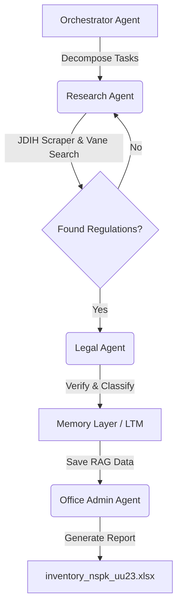

# TASK-034: NSPK Inventory UU 23/2014 (2014-2025)

**Status:** ACTIVE
**Priority**: HIGH
**Assignee**: Legal Agent + Research Agent
**Created**: 2026-03-25
**Due**: 2026-04-08 (2 weeks)
**Labels**: `legal`, `mcp`, `uu-23-2014`, `nspk`, `inventory`

---

## 📋 Ringkasan & Ruang Lingkup

Tugas ini diperluas untuk mencakup pemetaan NSPK pada seluruh **32 Urusan Pemerintahan Konkuren** sejak diundangkannya UU 23/2014 hingga kondisi terkini (**2014 - 2025**). Pencarian melibatkan portal regulasi utama (**JDIH Setneg**, **Peraturan.go.id**, **Peraturan BPK**, **JDIH Kemenkumham**) dan berkas kerja teknis dari **Google Drive: Matriks DIM 23/2014**.

### 1. Urusan Wajib Pelayanan Dasar (6 Urusan)
1. Pendidikan
2. Kesehatan
3. Pekerjaan Umum dan Penataan Ruang
4. Perumahan Rakyat dan Kawasan Permukiman
5. Ketenteraman, Ketertiban Umum, dan Pelindungan Masyarakat
6. Sosial

### 2. Urusan Wajib Non-Pelayanan Dasar (18 Urusan)
7. Tenaga Kerja
8. Pemberdayaan Perempuan dan Pelindungan Anak
9. Pangan
10. Pertanahan
11. Lingkungan Hidup
12. Administrasi Kependudukan dan Pencatatan Sipil
13. Pemberdayaan Masyarakat dan Desa
14. Pengendalian Penduduk dan Keluarga Berencana
15. Perhubungan
#### 16. Komunikasi & Informatika
- **Permen Kominfo 4/2024**: Penyelenggaraan Urusan Pemerintahan Konkuren Bidang Komunikasi dan Informatika (Amanat terbaru, mencabut Permen 8/2019).
- **Permen Kominfo 41/2014**: Pedoman Kehadiran Pegawai (NSPK Kepegawaian Sektoral).
17. Koperasi, Usaha Kecil, dan Menengah
18. Penanaman Modal
19. Kepemudaan dan Olahraga
20. Statistik
21. Persandian
22. Kebudayaan
23. Perpustakaan
24. Kearsipan

### 3. Urusan Pilihan (8 Urusan)
25. Kelautan dan Perikanan
26. Pariwisata
27. Pertanian
28. Kehutanan
29. Energi dan Sumber Daya Mineral
30. Perdagangan
31. Perindustrian
32. Transmigrasi

---

## 🎯 Tujuan

1.  **Comprehensive Matching**: Mengidentifikasi minimal satu instrumen NSPK (PP/Perpres/Permen) untuk setiap 32 urusan di atas (2014-2025).
2.  **Amanat Formulasi**: Menentukan apakah amanat NSPK berasal dari batang tubuh UU atau pendelegasian regulasi turunan.
3.  **Knowledge Ingestion**: Memasukkan 32 klaster data ini ke dalam Knowledge Base legal.

---

## 📅 Implementation Roadmap

### Phase 1: Research & Discovery (Ongoing) 🔍
**Tujuan**: Mengumpulkan data regulasi dari berbagai sumber online.
- [ ] **1.1** Scan JDIH Setneg, BPK, & Kemenkumham (2014-2025)
- [ ] **1.2** Ekstraksi Data dari Google Drive (Matriks DIM)
- [ ] **1.3** Sinkronisasi temuan per Direktorat SUPD I-IV

### Phase 2: Analysis & Validation ⚖️
**Tujuan**: Memastikan validitas hukum regulasi sebagai instrumen NSPK.
- [ ] **2.1** Analisis pasal konsiderans untuk referensi UU 23/2014 & UU Cipta Kerja
- [ ] **2.2** Audit ketetapan waktu (cek apakah terbit < 2 tahun atau revisi pasca-2021)

### Phase 3: Knowledge Base Sync 🧠
- [ ] **3.1** Ingest data NSPK ke **Long-Term Memory (LTM)**

### Phase 4: Reporting & Delivery 📊
- [ ] **4.1** Generate Laporan Inventaris NSPK (Excel)

---

## 🏗️ Collaborative Agent Workflow

---

## 🔄 Status Updates

| Date | Status | Notes |
|------|--------|-------|
| 2026-03-25 | 🔵 ACTIVE | Task initialized. Starting Phase 1 (Research) for 32 Urusan. |
| 2026-03-25 | 🟠 EXPANDING | **Scope Expansion**: Menambah periode riset (2017-2025) dan portal sumber (Setneg, BPK, Kemenkumham). |
| 2026-03-25 | 📂 G-DRIVE SYNC | **Data Extraction**: Berhasil mengidentifikasi Matriks Kewenangan dari folder Google Drive (SUPD I-IV). |

### 📂 Referensi Berkas Teknis (Google Drive)

Data teknis tambahan telah didentifikasi dari folder [Matriks DIM 23/2014](https://drive.google.com/drive/folders/19WJ2gFVrM9E1iy2HS0gOBma7P0rG-2lx), yang membagi urusan berdasarkan Direktorat SUPD Kemendagri:

- **Direktorat SUPD I (Ekonomi & SDA)**: Urusan Pertanian, Pangan.
- **Direktorat SUPD II (Sarana & Prasarana)**: Urusan Pekerjaan Umum, Kominfo, Perhubungan, Statistik & Persandian, Kelautan & Perikanan.
- **Direktorat SUPD III (Perekonomian & Industri)**: Urusan Perindustrian, Perdagangan, Energi dan Sumber Daya Mineral, Pariwisata.
- **Direktorat SUPD IV (Kesra & Pemerintahan)**: Urusan Trantibumlinmas, Penanaman Modal, Pemberdayaan Masyarakat dan Desa, Koperasi & UKM, Admindukcapil, Kesehatan, Sosial, Kebudayaan.
- **Matriks "Semula Menjadi"**: Berisi perbandingan detail pembagian kewenangan antara Pusat, Provinsi, dan Kab/Kota untuk navigasi NSPK yang lebih presisi.

### 🔍 Temuan Perkembangan (Batch 6 & 7: 2017-2025)

#### Era Cipta Kerja (Regulasi Induk Risiko)
- **PP 5/2021 & PP 28/2025**: Penyelenggaraan Perizinan Berusaha Berbasis Risiko (NSPK Core).
- **PP 2/2018**: Standar Pelayanan Minimal (SPM) - Pondasi baru pelayanan dasar.

#### Highlight Per Urusan (Update):
- **Tenaga Kerja**: PP 34/2021 (TKA), PP 35/2021 (PHK/PKWT).
- **Pertanahan**: PP 64/2021 (Bank Tanah).
- **Lingkungan Hidup**: PP 22/2021 (AMDAL/Baku Mutu).
#### 16. Komunikasi & Informatika
- **Permen Kominfo 4/2024**: Penyelenggaraan Urusan Pemerintahan Konkuren Bidang Komunikasi dan Informatika (Penyelarasan Transformasi Digital Daerah).
- **PP 46/2021**: Pos, Telekomunikasi, dan Penyiaran (NSPK Konvergensi).
- **Kelautan**: PP 27/2021 (Sektor Kelautan).
- **ESDM**: UU 6/2023 (Penetapan urusan energi daerah).

---

*Generated by MCP Task Manager*
*Assignee: legal_agent_v2_0*
